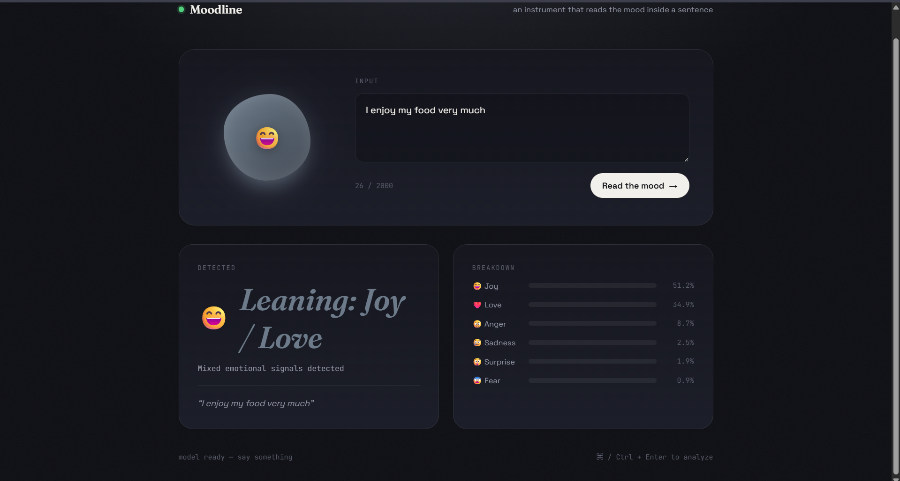
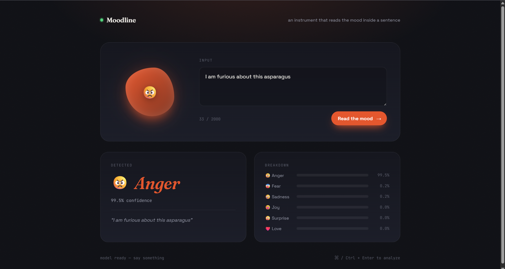
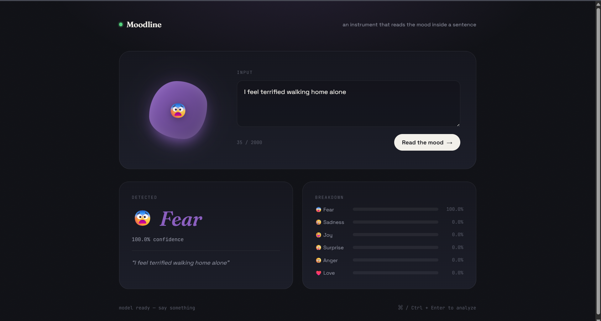

# Moodline — Emotion Prediction from Text

A FastAPI + deep learning app that predicts the emotion behind a sentence
across 6 classes: **sadness, joy, love, anger, fear, surprise**.

**Live demo:** https://emotion-prediction-0fey.onrender.com — currently running the original BiGRU
model. See [Known Issues](#known-limitations) for why this differs from the code in this repo.

---

## What this project demonstrates

- End-to-end ML workflow: dataset → preprocessing → training → evaluation → deployment
- Debugging a real, reproducible model bug through hypothesis-driven testing, not guesswork
- Comparing two architectures on measured evidence rather than assumption
- Adding a safety mechanism (confidence thresholding) and tuning it with real data
- Honest handling of a real deployment constraint instead of hiding it

---

## The bug I found

The original from-scratch BiGRU model, despite reporting ~92% test
accuracy, confidently misclassified simple, unambiguous sentences —
for example:

> **"I enjoy my food very much" → Anger (59.1% confidence)**

I loaded the model and tokenizer directly and reproduced the bug, then
traced the root cause: the word **"food" appeared only 63 times** across
16,000 training examples. With embeddings trained entirely from scratch
on a small, narrow (Twitter-sourced) dataset, rare words like this ended
up with unstable, spuriously-biased representations that dominated
predictions regardless of the rest of the sentence.

A second failure mode showed up too: sentences with a single, isolated
emotion cue word (e.g. "I am so happy today") produced low-confidence,
near-random predictions — the model relied on multiple reinforcing words
rather than robust single-word understanding.

---

## The fix

Replaced the from-scratch trainable embedding layer with **frozen,
pretrained MiniLM (`all-MiniLM-L6-v2`) token embeddings**, feeding the
resulting sequence into a lightweight BiGRU classifier head. The
transformer itself is never fine-tuned — it runs once per sentence to
produce embeddings, keeping both training and inference CPU-friendly.

Two architectures were tried and measured honestly before choosing one:

| Approach | Test Accuracy | Notes |
|---|---|---|
| Original from-scratch BiGRU | ~92%* | *Methodology flaw: test set doubled as the early-stopping validation set |
| MiniLM pooled sentence embedding + Dense head | 69% | Fixed the rare-word bug, but pooling to one vector discarded word-order/sequence information, hurting overall accuracy |
| **MiniLM per-token embeddings + BiGRU head (shipped)** | **86%** | Cleanly measured — test set touched exactly once. Fixed both bugs while recovering most of the accuracy lost to pooling |

### Before / after on the original bugs

| Sentence | Old Model | New Model |
|---|---|---|
| "I enjoy my food very much" | anger (59.1%) | joy (51.2%) / love (34.9%) — shown as "Leaning: Joy / Love" |
| "I love this food" | anger (87.9%) | love (64.5%) / joy (25.7%) |
| "I am so happy today" | anger/sadness near-tied (~31%) | joy (91.9%) |
| "I can't believe how happy I am right now, this is amazing!" | fear (53.3%) — wrong | joy (73.9%) / surprise (24.4%) — shown as "Leaning: Joy / Surprise" but correctly positive |
| "I am furious about this asparagus" | *(untested on old model)* | anger (99.5%) — confidently correct despite rare word |
| "I'm thrilled about this food" | *(untested on old model)* | joy (99.9%) — confidently correct |

---

## Confidence threshold safeguard

Because a softmax classifier is always forced to pick across its 6
classes — even for genuinely ambiguous or neutral input — I added a
threshold in the backend: if the top prediction is below 80%, the app
returns `"uncertain"` instead of naming a specific emotion outright.

Rather than showing an unhelpful generic "Uncertain" label, the UI
computes the top two leaning emotions from the model's own probability
breakdown and displays them directly — e.g. **"Leaning: Joy / Love"** —
so the honest hedge reads as a real finding instead of a broken result.

Testing this threshold surfaced a genuinely interesting pattern: the
model doesn't hedge randomly. It hedges specifically where there's real
linguistic overlap between classes, and stays confident where there
isn't. For example, "enjoy"/"love" language around food splits between
**joy** and **love** (a real ambiguity — people use both to mean the
same thing), while a word like "thrilled" has no such overlap and
resolves to joy at 99.9% confidence. The threshold reflects genuine
model uncertainty rather than being a blunt catch-all.

At 80%, this threshold catches most — but not all — confidently wrong
guesses on neutral input (see [Known Limitations](#known-limitations)).

---

## Screenshots

### 1. Rare-word bug — now honestly uncertain instead of confidently wrong
*Old model: "anger" at 59.1% confidence. New model: correctly reads the
sentence as positive (anger drops to 8.7%), and shows "Leaning: Joy / Love"
instead of a flat wrong guess.*



### 2. Rare word + strong negative emotion — stays confidently correct
*"I am furious about this asparagus" — a mostly unseen word doesn't
derail the model. Confident anger at 99.5%.*



### 3. Clean, unambiguous case — full confidence, no hedging
*"I feel terrified walking home alone" — a clear, single-emotion sentence
with no ambiguity. The model commits fully and correctly, contrasting
with the hedged "food" example above.*



---

## Known limitations

- **The dataset has no "neutral" class.** Since softmax always forces a
  choice across the 6 emotions, plainly neutral sentences (e.g. "The
  train arrives at 9am") can still receive a confidently wrong emotion
  label. The confidence threshold catches most of these — but in
  testing, roughly 1 in 3 neutral sentences still slipped through even
  at an 80% threshold. This is a structural limitation of a 6-class
  forced-choice classifier on a dataset with no neutral option, not
  something fixable by further threshold tuning alone.
- **Live demo runs the older BiGRU model, not the current code.** The
  MiniLM-based model loads both TensorFlow and PyTorch plus the
  transformer weights simultaneously, which exceeds free-tier hosting
  memory limits (512MB) on Render. Rather than force a paid upgrade,
  I kept the previously-working deployment live and documented the fix
  here instead. The evaluation and screenshots above reflect the actual
  current code in this repo — clone it and run locally (see below) to
  see it directly.

---

## Setup

```bash
git clone https://github.com/Debasish65368/EMOTION-PREDICTION.git
cd EMOTION-PREDICTION
python -m venv .venv
.venv\Scripts\Activate.ps1        # Windows
pip install -r requirements.txt
uvicorn main:app --reload --port 8000
```

Then open `http://127.0.0.1:8000` in your browser.


## API

### POST `/predict`

Predicts the emotion of the given text and returns
the confidence score along with probabilities for
all 6 emotions.

**Request:**

```json
{
  "text": "I am so happy today"
}
```

**Response:**

```json
{
  "predicted_emotion": "joy",
  "confidence": 0.91,
  "all_probabilities": {
    "sadness": 0.01,
    "joy": 0.91,
    "love": 0.03,
    "anger": 0.01,
    "fear": 0.02,
    "surprise": 0.02
  }
}
```

## Tech stack

- **Backend:** FastAPI, TensorFlow/Keras, PyTorch, Hugging Face Transformers
- **Model:** BiGRU classifier head over frozen `all-MiniLM-L6-v2` token embeddings
- **Frontend:** Vanilla HTML/CSS/JS
- **Dataset:** [dair-ai/emotion](https://huggingface.co/datasets/dair-ai/emotion)