<div align="center">


<br>

### A contextual NLP emotion classifier, served as a lightweight ONNX inference pipeline

<br>

[](https://emotion-prediction-0fey.onrender.com)

[](#-technology-stack)
[](#-api-reference)
[](#-production-inference-optimization)
[](#-model-architecture)
[](#-production-deployment-architecture)
[](#-model-architecture)

<br>

<table>
  <tr>
    <td align="center" width="260"><h1>89.85%</h1><b>🎯 Test Accuracy</b></td>
    <td align="center" width="260"><h1>86.46%</h1><b>📊 Macro F1</b></td>
  </tr>
</table>

<sub>Official 2,000-example test split of <code>dair-ai/emotion</code></sub>

<br>

<sub>
<a href="#-what-is-moodline">✨ Overview</a> ·
<a href="#-system-architecture">🧩 Architecture</a> ·
<a href="#-model-architecture">🧠 Model</a> ·
<a href="#-model-performance">📊 Performance</a> ·
<a href="#-production-inference-optimization">⚡ Optimization</a> ·
<a href="#-confidence-and-uncertainty-handling">🛡️ Uncertainty</a> ·
<a href="#-api-reference">🔌 API</a> ·
<a href="#-local-setup">🧪 Run it</a> ·
<a href="#-limitations">⚠️ Limitations</a>
</sub>

</div>

---

## ✨ What is Moodline?

Type a sentence, get the emotion behind it: **😢 sadness · 😄 joy · ❤️ love · 😠 anger · 😨 fear · 😲 surprise**, with a confidence score and a full probability breakdown.

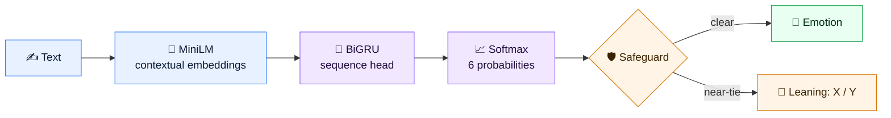
```mermaid
flowchart LR
    A["✍️ Text"] --> B["🧠 MiniLM<br/>contextual embeddings"]
    B --> C["🔁 BiGRU<br/>sequence head"]
    C --> D["📈 Softmax<br/>6 probabilities"]
    D --> E{"🛡️ Safeguard"}
    E -->|"clear"| F["🎯 Emotion"]
    E -->|"near-tie"| G["🤔 Leaning: X / Y"]

    classDef a fill:#e8f1ff,stroke:#3b82f6,color:#0b1b33
    classDef b fill:#f1e8ff,stroke:#8b5cf6,color:#1f0b3b
    classDef c fill:#e8fff1,stroke:#16a34a,color:#052e16
    classDef d fill:#fff4e5,stroke:#d97706,color:#3b2300
    class A,B a
    class C,D b
    class F c
    class E,G d
```

| | |
|---|---|
| 🧱 **Model** | MiniLM (`all-MiniLM-L6-v2`, last layer fine-tuned) + bidirectional GRU head, exported to **one ONNX file** |
| ⚙️ **Serving** | FastAPI + ONNX Runtime + HuggingFace Rust tokenizers. No PyTorch, Transformers, or TensorFlow at runtime |
| 🛡️ **Honesty** | A two-condition safeguard turns near-ties into `Leaning: X / Y` instead of forced certainty |
| ☁️ **Deployed** | Live on Render, inside a 512 MB memory limit |

## 🎯 Why this project is interesting

| | Challenge | What this repo shows |
|:---:|---|---|
| 🧠 | Sequence classification | MiniLM token embeddings (50 × 384) into a BiGRU, so word order reaches the classifier |
| 🎚️ | Controlled fine-tuning | Only the last encoder layer and the head are trained |
| ⚖️ | Imbalanced data | Weighted loss with deliberately conservative class weights |
| 📦 | Constrained deployment | ≈ 630 MB native serving cut to ≈ 318 MB (measured locally) for a 512 MB limit |
| 🛡️ | Uncertainty | Near-ties are surfaced, not hidden |
| 🔍 | Honest evaluation | Official test split plus documented limitations |

## 🚀 Live demo

> ### 👉 **https://emotion-prediction-0fey.onrender.com**
> ⏳ Hosted on Render Free: after inactivity the first request cold-starts. The UI polls `/health` and unlocks the input once the server is ready.

## 🖥️ Product preview

<table>
  <tr>
    <td width="50%">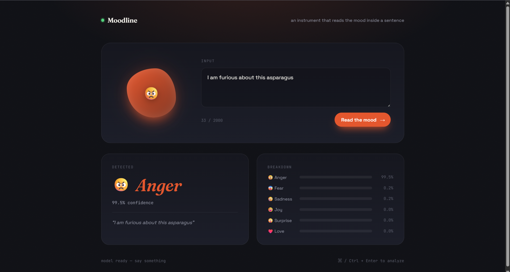</td>
    <td width="50%">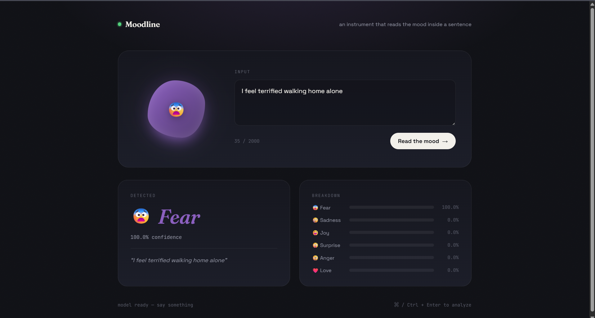</td>
  </tr>
  <tr>
    <td align="center"><sub>😠 <b>Detected emotion + probability bars</b><br>"I am furious about this asparagus"</sub></td>
    <td align="center"><sub>😨 <b>Per-emotion accent color, sorted breakdown</b><br>"I feel terrified walking home alone"</sub></td>
  </tr>
</table>

Vanilla HTML/CSS/JS · 2,000-character input · `Ctrl/⌘ + Enter` to submit · live status dot from `/health` · when the safeguard fires the card reads `Leaning: X / Y` and `Mixed emotional signals detected`.

---

## 🧩 System architecture

Five lanes, left to right: **client → API → ONNX engine → post-processing → result**. The training lane (bottom) runs offline and only hands one `.onnx` file to production.

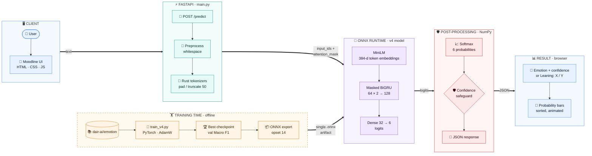
```mermaid
flowchart LR
    subgraph CLIENT["🖥️ CLIENT"]
        direction TB
        U(["👤 User"]) --> UI["🎨 Moodline UI<br/>HTML · CSS · JS"]
    end

    subgraph SERVER["⚡ FASTAPI · main.py"]
        direction TB
        API["🔌 POST /predict"] --> PRE["🧹 Preprocess<br/>whitespace"]
        PRE --> TOK["🦀 Rust tokenizers<br/>pad / truncate 50"]
    end

    subgraph TRAIN["🏋️ TRAINING TIME · offline"]
        direction LR
        DS[("📚 dair-ai/emotion")] --> TR["🔧 train_v4.py<br/>PyTorch · AdamW"]
        TR --> CK["🏆 Best checkpoint<br/>val Macro F1"]
        CK --> EX["📦 ONNX export<br/>opset 14"]
    end

    subgraph ENGINE["🧠 ONNX RUNTIME · v4 model"]
        direction TB
        MINI["MiniLM<br/>384-d token embeddings"] --> BG["Masked BiGRU<br/>64 × 2 → 128"]
        BG --> HD["Dense 32 → 6<br/>logits"]
    end

    subgraph RESULT["📊 RESULT · browser"]
        direction TB
        VZ["🎯 Emotion + confidence<br/>or Leaning: X / Y"] --> BARS["📶 Probability bars<br/>sorted, animated"]
    end

    subgraph POST["🛡️ POST-PROCESSING · NumPy"]
        direction TB
        SM["📈 Softmax<br/>6 probabilities"] --> GD{"🛡️ Confidence<br/>safeguard"}
        GD --> JS["📨 JSON response"]
    end

    CLIENT ==>|"text"| SERVER
    SERVER ==>|"input_ids +<br/>attention_mask"| ENGINE
    ENGINE ==>|"logits"| POST
    POST ==>|"JSON"| RESULT
    TRAIN ==>|"single .onnx<br/>artifact"| ENGINE

    classDef train fill:#fff4e5,stroke:#d97706,color:#3b2300
    classDef client fill:#e8f1ff,stroke:#3b82f6,color:#0b1b33
    classDef api fill:#e6fbf7,stroke:#0d9488,color:#042f2e
    classDef eng fill:#f1e8ff,stroke:#8b5cf6,color:#1f0b3b
    classDef post fill:#fde8e8,stroke:#dc2626,color:#3b0a0a
    class DS,TR,CK,EX train
    class U,UI,VZ,BARS client
    class API,PRE,TOK api
    class MINI,BG,HD eng
    class SM,GD,JS post
    style TRAIN fill:#fffaf0,stroke:#d97706,stroke-dasharray:5 5
    style CLIENT fill:#f4f8ff,stroke:#3b82f6
    style SERVER fill:#f2fdfb,stroke:#0d9488
    style ENGINE fill:#f8f4ff,stroke:#8b5cf6
    style RESULT fill:#f4f8ff,stroke:#3b82f6
    style POST fill:#fff5f5,stroke:#dc2626
```

| Lane | Role |
|---|---|
| 🖥️ **Client** (`static/`) | Polls `/health`, posts text, renders emotion, confidence, and bars |
| ⚡ **FastAPI** (`main.py`) | Loads tokenizer + ONNX session once at startup; serves API and UI |
| 🧠 **ONNX Runtime** | One graph on `CPUExecutionProvider`, 1 intra-op + 1 inter-op thread; outputs **logits** |
| 🛡️ **Post-processing** | NumPy softmax, top-2 extraction, confidence safeguard, JSON |

---

## 🔄 End-to-end inference flow

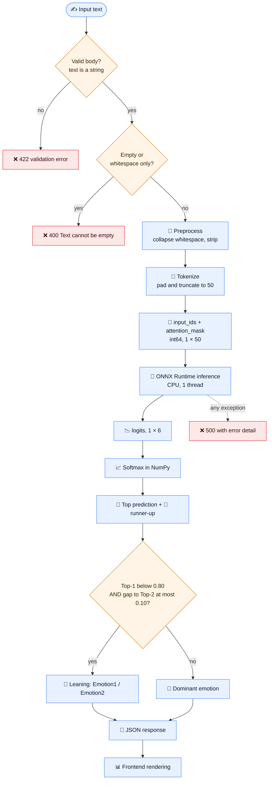
```mermaid
flowchart TD
    A(["✍️ Input text"]) --> B{"Valid body?<br/>text is a string"}
    B -->|"no"| E422["❌ 422 validation error"]
    B -->|"yes"| C{"Empty or<br/>whitespace only?"}
    C -->|"yes"| E400["❌ 400 Text cannot be empty"]
    C -->|"no"| D["🧹 Preprocess<br/>collapse whitespace, strip"]
    D --> E["🦀 Tokenize<br/>pad and truncate to 50"]
    E --> F["🔢 input_ids + attention_mask<br/>int64, 1 × 50"]
    F --> G["🧠 ONNX Runtime inference<br/>CPU, 1 thread"]
    G --> H["📉 logits, 1 × 6"]
    H --> I["📈 Softmax in NumPy"]
    I --> J["🥇 Top prediction + 🥈 runner-up"]
    J --> K{"Top-1 below 0.80<br/>AND gap to Top-2 at most 0.10?"}
    K -->|"yes"| L["🤔 Leaning: Emotion1 / Emotion2"]
    K -->|"no"| M["🎯 Dominant emotion"]
    L --> N["📨 JSON response"]
    M --> N
    N --> O["📊 Frontend rendering"]
    G -.->|"any exception"| E500["❌ 500 with error detail"]

    classDef ok fill:#e8f1ff,stroke:#3b82f6,color:#0b1b33
    classDef err fill:#fde8e8,stroke:#dc2626,color:#3b0a0a
    classDef dec fill:#fff4e5,stroke:#d97706,color:#3b2300
    class A,D,E,F,G,H,I,J,L,M,N,O ok
    class E422,E400,E500 err
    class B,C,K dec
```

<sub>Input over 50 tokens is truncated by the tokenizer. The UI caps input at 2,000 characters; the API enforces no length limit.</sub>

---

## 🧠 Model architecture

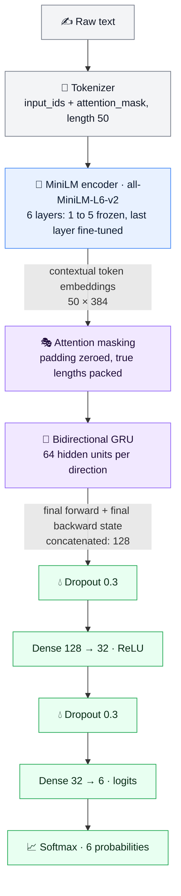
```mermaid
flowchart TB
    RAW["✍️ Raw text"] --> TOKN["🔢 Tokenizer<br/>input_ids + attention_mask, length 50"]
    TOKN --> MINI["🧠 MiniLM encoder · all-MiniLM-L6-v2<br/>6 layers: 1 to 5 frozen, last layer fine-tuned"]
    MINI -->|"contextual token embeddings<br/>50 × 384"| MASK["🎭 Attention masking<br/>padding zeroed, true lengths packed"]
    MASK --> GRU["🔁 Bidirectional GRU<br/>64 hidden units per direction"]
    GRU -->|"final forward + final backward state<br/>concatenated: 128"| D1["💧 Dropout 0.3"]
    D1 --> DENSE1["Dense 128 → 32 · ReLU"]
    DENSE1 --> D2["💧 Dropout 0.3"]
    D2 --> DENSE2["Dense 32 → 6 · logits"]
    DENSE2 --> SOFT["📈 Softmax · 6 probabilities"]

    classDef io fill:#f3f4f6,stroke:#6b7280,color:#111827
    classDef enc fill:#e8f1ff,stroke:#3b82f6,color:#0b1b33
    classDef seq fill:#f1e8ff,stroke:#8b5cf6,color:#1f0b3b
    classDef head fill:#e8fff1,stroke:#16a34a,color:#052e16
    class RAW,TOKN io
    class MINI enc
    class MASK,GRU seq
    class D1,DENSE1,D2,DENSE2,SOFT head
```

> 💡 **Training vs. production.** Dropout only acts during training. The exported ONNX graph ends at **logits**; softmax runs in FastAPI (NumPy).

| Block | What it does |
|---|---|
| 🧠 **MiniLM encoder** | 6-layer transformer, one **384-d** contextual vector per token, so the same word embeds differently in different sentences |
| 🎚️ **Fine-tuning** | All encoder weights frozen, then only the **last layer** unfrozen (`unfreeze_layers=1`). Learning rate `2e-5` |
| 🔁 **BiGRU head** | Reads the 50 × 384 sequence in both directions (64 units each); padding is masked and lengths packed, so padding never affects the state |
| 🧮 **Classifier** | `Dropout 0.3 → Linear 128→32 → ReLU → Dropout 0.3 → Linear 32→6`. Learning rate `1e-3` |
| 📈 **Softmax** | Probabilities in fixed order: `sadness, joy, love, anger, fear, surprise` |

<details>
<summary>🔬 <b>Exported graph facts</b> (inspected from the shipped <code>.onnx</code>)</summary>

| Property | Value |
|---|---|
| File | `Artifacts/MiniLM_Sequence_Classifier_v4.onnx` (≈ 91 MB) |
| Opset / producer | 14 / PyTorch 2.13.0 |
| Inputs | `input_ids`, `attention_mask` (int64, dynamic `batch_size` × `sequence_length`) |
| Output | `logits` (float32, `batch_size` × 6) |
| Weights | ≈ 22.7 M elements, float32 (not quantized) |
| GRU | No native ONNX `GRU` op; exported as unrolled elementary ops (3,151 nodes total) |

</details>

---

## 🏋️ Training pipeline

Source of truth: [`training/train_v4.py`](training/train_v4.py)

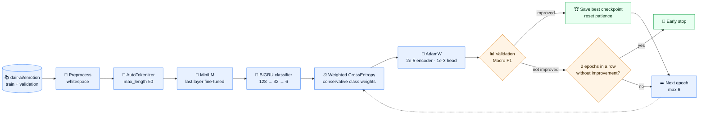
```mermaid
flowchart LR
    DS[("📚 dair-ai/emotion<br/>train + validation")] --> PRE["🧹 Preprocess<br/>whitespace"]
    PRE --> TOK["🔢 AutoTokenizer<br/>max_length 50"]
    TOK --> ENC["🧠 MiniLM<br/>last layer fine-tuned"]
    ENC --> HEAD["🔁 BiGRU classifier<br/>128 → 32 → 6"]
    HEAD --> LOSS["⚖️ Weighted CrossEntropy<br/>conservative class weights"]
    LOSS --> OPT["🚀 AdamW<br/>2e-5 encoder · 1e-3 head"]
    OPT --> VAL{"📊 Validation<br/>Macro F1"}
    VAL -->|"improved"| SAVE["🏆 Save best checkpoint<br/>reset patience"]
    VAL -->|"not improved"| PAT{"2 epochs in a row<br/>without improvement?"}
    PAT -->|"yes"| STOP["🛑 Early stop"]
    PAT -->|"no"| NEXT["➡️ Next epoch<br/>max 6"]
    SAVE --> NEXT
    NEXT -.-> LOSS

    classDef n fill:#e8f1ff,stroke:#3b82f6,color:#0b1b33
    classDef d fill:#fff4e5,stroke:#d97706,color:#3b2300
    classDef s fill:#e8fff1,stroke:#16a34a,color:#052e16
    class DS,PRE,TOK,ENC,HEAD,LOSS,OPT,NEXT n
    class VAL,PAT d
    class SAVE,STOP s
```

| Setting | Value |
|---|---|
| 📚 Data | `dair-ai/emotion`: `train` to fit, `validation` to select the model |
| 🧹 Preprocessing | Whitespace collapsed and trimmed only; punctuation and negations reach the encoder |
| 🔢 Tokenization | `max_length=50`, `padding="max_length"`, truncation on |
| ⚖️ Class weights | `(balanced + 1) / 2`: balanced weights blended with uniform, so minority classes are helped without collapsing majority-class performance |
| 🚀 Optimizer | `AdamW`, two groups: encoder `2e-5`, classifier `1e-3` |
| 🔁 Schedule | Batch size 32 · up to 6 epochs · seed 42 |
| 🏆 Selection | Best validation **Macro F1**, early stopping with patience 2 |
| 🧪 Evaluation | Untouched 2,000-example `test` split, never used for checkpoint selection |

```bash
pip install -r training/requirements-training.txt --extra-index-url https://download.pytorch.org/whl/cpu
python -m training.train_v4      # writes Artifacts/MiniLM_Sequence_Classifier_v4.pt
```

> 🔁 **Reproducibility scope.** `train_v4.py` reproduces the model and training recipe. The ONNX export and the v4 test/parity evaluation used scratch scripts that are git-ignored (`export_onnx.py`, `eval_*.py`), and the `.pt` checkpoint is not shipped. The `.onnx` file in `Artifacts/` is the production artifact.

---

## 📊 Model performance

Evaluated on the **untouched 2,000-example test split** (six classes). The **ONNX production export was validated at parity** with these metrics.

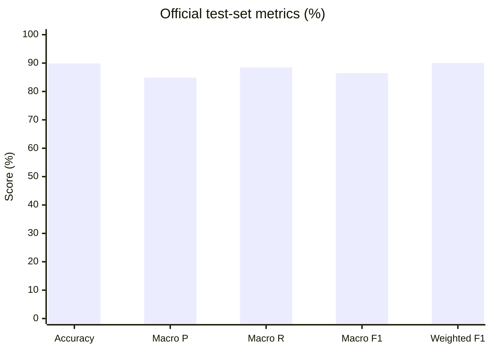
```mermaid
xychart-beta
    title "Official test-set metrics (%)"
    x-axis ["Accuracy", "Macro P", "Macro R", "Macro F1", "Weighted F1"]
    y-axis "Score (%)" 0 --> 100
    bar [89.85, 84.86, 88.47, 86.46, 90.01]
```

| Metric | Score | |
|---|---:|---|
| 🎯 Accuracy | **89.85%** | share of correct predictions |
| 🔬 Macro Precision | 84.86% | averaged equally over 6 classes |
| 🔎 Macro Recall | 88.47% | averaged equally over 6 classes |
| 📊 Macro F1 | **86.46%** | balanced view across all classes |
| ⚖️ Weighted F1 | 90.01% | weighted by class size |

<sub>Weighted F1 above Macro F1 reflects class imbalance: larger classes score higher and smaller ones pull the macro average down. No per-class report or confusion matrix for v4 is tracked in this repository, so none is shown.</sub>

---

## ⚡ Production inference optimization

> **The core engineering story.** Native PyTorch + Transformers serving needed ≈ **630 MB**. Render Free allows **512 MB**. Moving to ONNX Runtime + Rust tokenizers brought the production worker to **≈ 314 MB idle / ≈ 318 MB under active inference**.

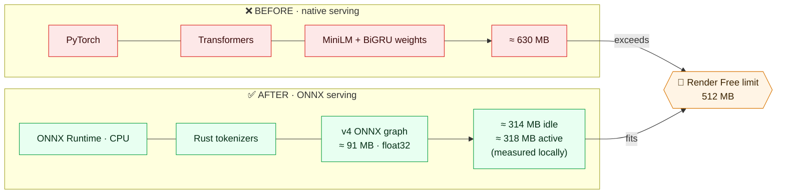
```mermaid
flowchart LR
    subgraph BEFORE["❌ BEFORE · native serving"]
        direction TB
        P1["PyTorch"] --- P2["Transformers"] --- P3["MiniLM + BiGRU weights"]
        P3 --> PM["≈ 630 MB"]
    end

    subgraph AFTER["✅ AFTER · ONNX serving"]
        direction TB
        O1["ONNX Runtime · CPU"] --- O2["Rust tokenizers"] --- O3["v4 ONNX graph<br/>≈ 91 MB · float32"]
        O3 --> OM["≈ 314 MB idle<br/>≈ 318 MB active<br/>(measured locally)"]
    end

    LIMIT{{"🚧 Render Free limit<br/>512 MB"}}
    PM -->|"exceeds"| LIMIT
    OM -->|"fits"| LIMIT

    classDef bad fill:#fde8e8,stroke:#dc2626,color:#3b0a0a
    classDef good fill:#e8fff1,stroke:#16a34a,color:#052e16
    classDef lim fill:#fff4e5,stroke:#d97706,color:#3b2300
    class P1,P2,P3,PM bad
    class O1,O2,O3,OM good
    class LIMIT lim
```

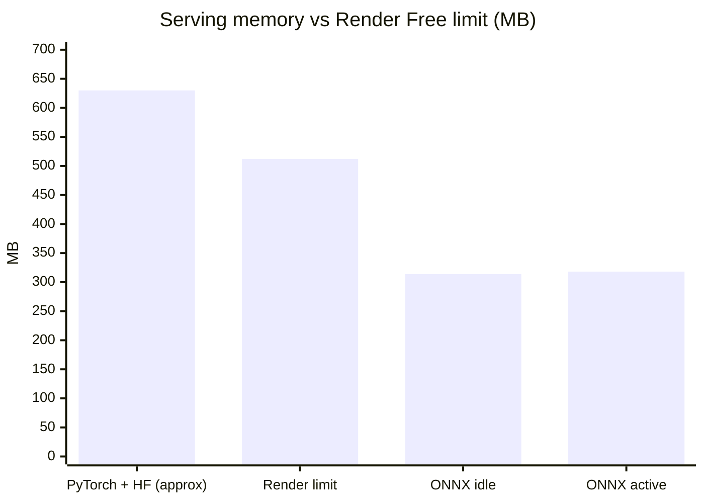
```mermaid
xychart-beta
    title "Serving memory vs Render Free limit (MB)"
    x-axis ["PyTorch + HF (approx)", "Render limit", "ONNX idle", "ONNX active"]
    y-axis "MB" 0 --> 700
    bar [630, 512, 314, 318]
```

> 📏 **What the numbers are.** 314 / 318 MB is the production worker footprint **measured locally**, not a Render dashboard reading. ≈ 630 MB is the approximate native PyTorch + Transformers serving footprint.

| ⚙️ Optimization | 💡 Why it helps |
|---|---|
| 🚫 **No PyTorch / Transformers / TensorFlow at runtime** | Six-package deploy set; heavy frameworks are never imported |
| 🧠 **ONNX Runtime, `CPUExecutionProvider`** | Compact, inference-only engine for the exported graph |
| 🦀 **HuggingFace Rust `tokenizers`** | Tokenization without the Transformers runtime |
| 🧵 **1 intra-op + 1 inter-op thread** | No thread pools competing for a small memory budget |
| 👤 **Single worker** (`workers=1`) | One process, one copy of the model |
| 📏 **Fixed 50-token padding** | Constant, small input tensors |
| ♻️ **`gc.collect()` per request** | Keeps the long-lived process stable on a small instance |
| 🎛️ **No lossy quantization** | Weights stay float32; the saving comes from the serving stack |

<sub>Trade-off: single-threaded, single-worker serving limits parallelism. Latency and throughput were **not benchmarked**, so none are claimed.</sub>

<details>
<summary>🧾 <b>Measured / reported facts vs. design decisions</b></summary>

| Measured / reported | Design decisions |
|---|---|
| Test metrics on the 2,000-example test split | Thresholds 0.80 and 0.10 |
| ONNX parity with those metrics | `max_length = 50` |
| ≈ 630 MB native serving footprint | One worker, one thread per pool |
| ≈ 314 / 318 MB production footprint (local) | Last-layer fine-tuning, conservative class weights |
| ONNX file ≈ 91 MB, ≈ 22.7 M weight elements | ONNX Runtime + Rust tokenizers over Transformers |

Not measured, not claimed: request latency, throughput, Render-side memory, per-class metrics.

</details>

---

## 🏗️ Production deployment architecture

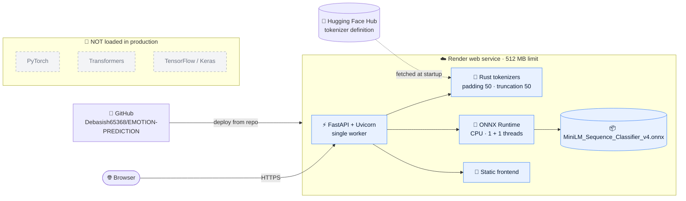
```mermaid
flowchart LR
    GH["🐙 GitHub<br/>Debasish65368/EMOTION-PREDICTION"] -->|"deploy from repo"| RD

    subgraph RD["☁️ Render web service · 512 MB limit"]
        direction TB
        FA["⚡ FastAPI + Uvicorn<br/>single worker"] --> TK["🦀 Rust tokenizers<br/>padding 50 · truncation 50"]
        FA --> OR["🧠 ONNX Runtime<br/>CPU · 1 + 1 threads"]
        OR --> M[("📦 MiniLM_Sequence_Classifier_v4.onnx")]
        FA --> ST["🎨 Static frontend"]
    end

    HF[("🤗 Hugging Face Hub<br/>tokenizer definition")] -.->|"fetched at startup"| TK
    BR(["🌐 Browser"]) -->|"HTTPS"| FA

    subgraph NOT["🚫 NOT loaded in production"]
        direction TB
        N1["PyTorch"]
        N2["Transformers"]
        N3["TensorFlow / Keras"]
    end

    classDef run fill:#e8f1ff,stroke:#3b82f6,color:#0b1b33
    classDef no fill:#f3f4f6,stroke:#9ca3af,color:#6b7280,stroke-dasharray: 5 5
    class FA,TK,OR,M,ST run
    class N1,N2,N3 no
```

| | |
|---|---|
| 🔗 **Live URL** | https://emotion-prediction-0fey.onrender.com |
| 📦 **One model** | `MiniLM_Sequence_Classifier_v4.onnx` is the only inference artifact loaded |
| 🚦 **Startup** | Tokenizer and ONNX session are created at import time; the tokenizer definition is fetched from the Hugging Face Hub on first start (internet needed), then cached |
| 📎 **Import note** | `main.py` imports `training/preprocessing.py`, which only uses `re`, so no training dependency is pulled in |
| 🐍 **Python** | 3.12 (`.python-version`, `runtime.txt`) |
| 📝 **Config** | No `render.yaml` is tracked in this repository |

---

## 🛡️ Confidence and uncertainty handling

Softmax always returns a distribution over six classes, even for ambiguous or out-of-domain text. Moodline treats a near-tie as **information**, not as a failure.

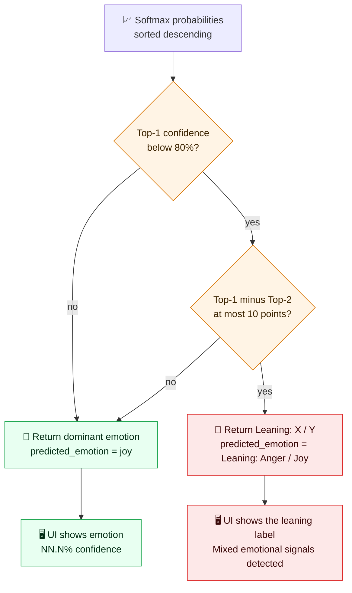
```mermaid
flowchart TD
    P["📈 Softmax probabilities<br/>sorted descending"] --> Q1{"Top-1 confidence<br/>below 80%?"}
    Q1 -->|"no"| NORMAL
    Q1 -->|"yes"| Q2{"Top-1 minus Top-2<br/>at most 10 points?"}
    Q2 -->|"no"| NORMAL["🎯 Return dominant emotion<br/>predicted_emotion = joy"]
    Q2 -->|"yes"| LEAN["🤔 Return Leaning: X / Y<br/>predicted_emotion = Leaning: Anger / Joy"]
    LEAN --> UI["🖥️ UI shows the leaning label<br/>Mixed emotional signals detected"]
    NORMAL --> UI2["🖥️ UI shows emotion<br/>NN.N% confidence"]

    classDef dec fill:#fff4e5,stroke:#d97706,color:#3b2300
    classDef lean fill:#fde8e8,stroke:#dc2626,color:#3b0a0a
    classDef ok fill:#e8fff1,stroke:#16a34a,color:#052e16
    class Q1,Q2 dec
    class LEAN,UI lean
    class NORMAL,UI2 ok
```

```python
if confidence < 0.80 and (confidence - second_confidence) <= 0.10:
    final_emotion_label = f"Leaning: {top_emotion.capitalize()} / {second_emotion.capitalize()}"
else:
    final_emotion_label = emotion_labels[top_idx]
```

Both conditions must hold. A prediction under 80% with a clear lead (more than 10 points) is still returned normally.

**🔎 Worked example: `She finally called me.`**

| Rank | Emotion | Probability |
|:---:|---|---:|
| 🥇 | Anger | ≈ 42.9% |
| 🥈 | Joy | ≈ 38.8% |

42.9% < 80% **and** the gap is ≈ 4.1 points (≤ 10), so the safeguard fires:

```text
DETECTED
Leaning: Anger / Joy
Mixed emotional signals detected
```

The sentence genuinely supports more than one reading, and the model says so. This is the safeguard working as designed. The UI also drops the single-emotion accent color, since no single emotion is claimed.

---

## 🔌 API reference

Base URL: `https://emotion-prediction-0fey.onrender.com` (locally `http://127.0.0.1:8000`). FastAPI's interactive docs are at `/docs`.

### 🟢 `GET /health`

Static liveness check; does not run inference.

```json
{ "status": "healthy", "model": "ONNX MiniLM BiGRU V4" }
```

### 🔮 `POST /predict`

Request:

```json
{ "text": "I feel terrified walking home alone" }
```

Normal response (*illustrative values; field names, types, rounding, and label format match `main.py`*):

```json
{
  "text": "I feel terrified walking home alone",
  "predicted_emotion": "fear",
  "confidence": 0.9712,
  "all_probabilities": {
    "sadness": 0.0121, "joy": 0.0034, "love": 0.0012,
    "anger": 0.0079, "fear": 0.9712, "surprise": 0.0042
  }
}
```

Safeguard response (*Anger and Joy come from the worked example; the other four values are illustrative filler*):

```json
{
  "text": "She finally called me.",
  "predicted_emotion": "Leaning: Anger / Joy",
  "confidence": 0.429,
  "all_probabilities": {
    "sadness": 0.071, "joy": 0.388, "love": 0.052,
    "anger": 0.429, "fear": 0.024, "surprise": 0.036
  }
}
```

| Field | Type | Meaning |
|---|---|---|
| `text` | string | Original request text, unmodified |
| `predicted_emotion` | string | Lowercase label for a normal prediction, or `Leaning: Emotion1 / Emotion2` (capitalized) when the safeguard fires |
| `confidence` | float | Softmax probability of the **top-1** class, 4 decimals; stays top-1 even for `Leaning:` results |
| `all_probabilities` | object | All six classes in order `sadness, joy, love, anger, fear, surprise`, 4 decimals each (sum may differ slightly from 1) |

| Status | When | Body |
|:---:|---|---|
| ❌ `400` | `text` empty or whitespace only | `{"detail": "Text cannot be empty"}` |
| ❌ `422` | Body missing or `text` not a string | Standard FastAPI validation detail |
| ❌ `500` | Exception in preprocessing, tokenization, or inference | `{"detail": "<error message>"}` |

**Other routes in `main.py`:** `GET /` serves `static/index.html` · `/static/*` serves assets · `GET /ram` is a developer diagnostic (process RSS in MB) that needs `psutil`, which is **not** in `requirements.txt`.

### 🔁 Request / response sequence

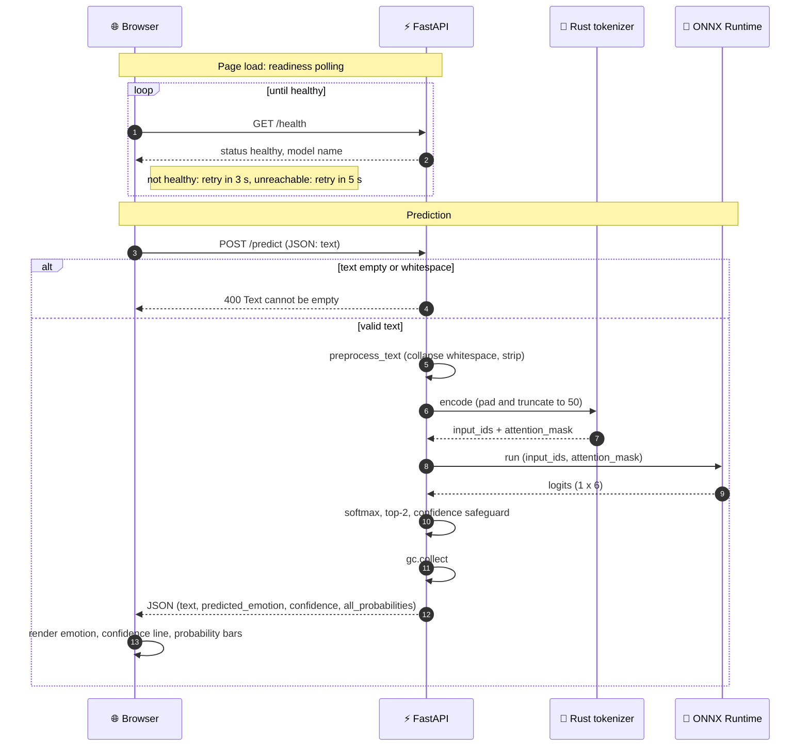
```mermaid
sequenceDiagram
    autonumber
    participant B as 🌐 Browser
    participant F as ⚡ FastAPI
    participant T as 🦀 Rust tokenizer
    participant O as 🧠 ONNX Runtime

    Note over B,F: Page load: readiness polling
    loop until healthy
        B->>F: GET /health
        F-->>B: status healthy, model name
        Note right of B: not healthy: retry in 3 s, unreachable: retry in 5 s
    end

    Note over B,O: Prediction
    B->>F: POST /predict (JSON: text)
    alt text empty or whitespace
        F-->>B: 400 Text cannot be empty
    else valid text
        F->>F: preprocess_text (collapse whitespace, strip)
        F->>T: encode (pad and truncate to 50)
        T-->>F: input_ids + attention_mask
        F->>O: run (input_ids, attention_mask)
        O-->>F: logits (1 x 6)
        F->>F: softmax, top-2, confidence safeguard
        F->>F: gc.collect
        F-->>B: JSON (text, predicted_emotion, confidence, all_probabilities)
        B->>B: render emotion, confidence line, probability bars
    end
```

### 🎛️ Frontend state machine

How `static/script.js` moves between states:

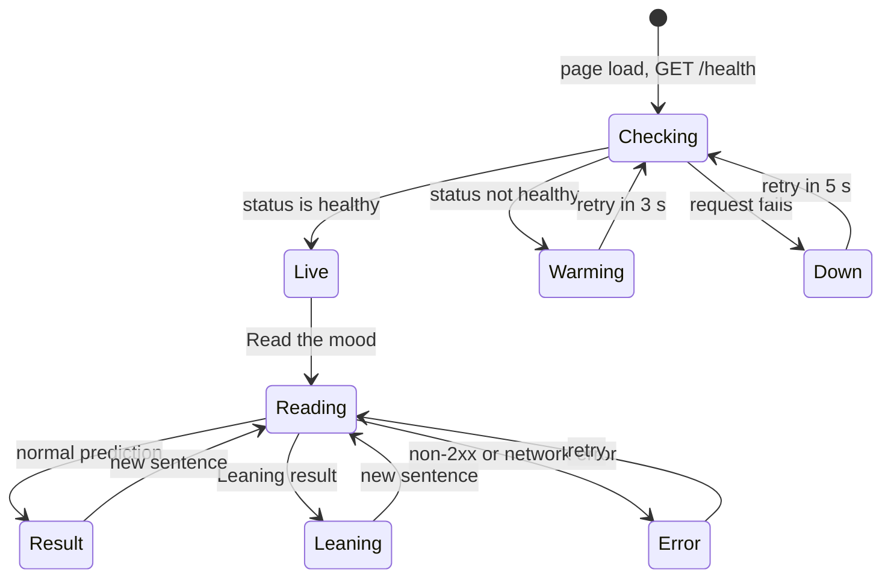
```mermaid
stateDiagram-v2
    [*] --> Checking: page load, GET /health
    Checking --> Live: status is healthy
    Checking --> Warming: status not healthy
    Checking --> Down: request fails
    Warming --> Checking: retry in 3 s
    Down --> Checking: retry in 5 s
    Live --> Reading: Read the mood
    Reading --> Result: normal prediction
    Reading --> Leaning: Leaning result
    Reading --> Error: non-2xx or network error
    Result --> Reading: new sentence
    Leaning --> Reading: new sentence
    Error --> Reading: retry
```

---

## 📁 Project structure

```text
EMOTION-PREDICTION/
│
│  ⚡ Production runtime
├── main.py                               # FastAPI app: /predict, /health, serves the UI
├── preprocessing.py                      # backward-compatible re-export of training/preprocessing.py
├── requirements.txt                      # FastAPI, Uvicorn, Pydantic, ONNX Runtime, tokenizers, NumPy
├── .python-version, runtime.txt          # Python 3.12
│
│  📦 Model artifact
├── Artifacts/
│   ├── MiniLM_Sequence_Classifier_v4.onnx    # the ONE production model (≈ 91 MB)
│   └── *.keras, tokenizer.pkl                # legacy artifacts of an earlier pipeline; not loaded
│
│  🎨 Static frontend
├── static/
│   ├── index.html
│   ├── script.js                         # health polling, /predict call, result + leaning rendering
│   └── style.css
├── assets/
│   └── banner.svg                        # README banner
├── screenshots/
│   ├── asparagus-anger.png
│   ├── terrified-fear.png
│   └── food-uncertain.png
│
│  🏋️ Training (not needed to serve the app)
├── training/
│   ├── train_v4.py                       # reproducible training source for the finalized model
│   ├── requirements-training.txt         # PyTorch, Transformers, datasets, scikit-learn, pandas
│   ├── preprocessing.py                  # shared preprocessing (also imported by main.py)
│   ├── __init__.py
│   └── model.py, data.py, train.py, evaluate.py, generate_embeddings.py, run_pipeline.ps1, README.md
│                                         # legacy: earlier Keras head-only pipeline on cached embeddings
│
├── final_clean.ipynb                     # early exploration: RNN / LSTM / GRU / BiGRU baselines
└── README.md
```

> ℹ️ `training/preprocessing.py` is the only `training/` file the app imports (stdlib `re` only). `training/model.py` is an older Keras definition and is **not** the production architecture, which is `MiniLM_BiGRU_V4` in `training/train_v4.py`.

---

## 🧪 Local setup

```bash
git clone https://github.com/Debasish65368/EMOTION-PREDICTION.git
cd EMOTION-PREDICTION

python -m venv .venv
# Windows
.venv\Scripts\activate
# Linux / macOS
source .venv/bin/activate

pip install -r requirements.txt
uvicorn main:app --reload --port 8000
```

Open **http://127.0.0.1:8000**. The first start needs internet (tokenizer download from the Hugging Face Hub). Training dependencies are **not** needed for inference.

## ✅ Testing

No automated test suite is included; use these practical checks.

```bash
# 1. Health
curl http://127.0.0.1:8000/health

# 2. Prediction
curl -X POST http://127.0.0.1:8000/predict \
  -H "Content-Type: application/json" \
  -d '{"text": "I feel terrified walking home alone"}'

# 3. Error handling (expect 400 {"detail":"Text cannot be empty"})
curl -X POST http://127.0.0.1:8000/predict \
  -H "Content-Type: application/json" -d '{"text": "   "}'
```

PowerShell: `Invoke-RestMethod -Uri http://127.0.0.1:8000/predict -Method Post -ContentType "application/json" -Body '{"text": "I feel terrified walking home alone"}'`

| Check | What to look for |
|---|---|
| 🖥️ **Frontend** | Footer shows `model ready`; submit with the button or `Ctrl/⌘ + Enter`; emotion, confidence line, and sorted bars render |
| 🛡️ **Safeguard** | Try `She finally called me.`; whenever top-1 < 80% and the top-2 gap ≤ 10 points, the label becomes `Leaning: X / Y`. Compare against `all_probabilities` |

---

## 🛠️ Technology stack

| Layer | Technologies |
|---|---|
| 🎨 **Frontend** | Vanilla HTML · CSS · JavaScript (no build step) · Google Fonts (Fraunces, Space Grotesk, JetBrains Mono) |
| ⚡ **Backend** | FastAPI 0.115.0 · Uvicorn 0.30.6 · Pydantic 2.9.2 · NumPy 2.1.1 |
| 🧠 **NLP / model** | `sentence-transformers/all-MiniLM-L6-v2` (last layer fine-tuned) · bidirectional GRU · MLP head |
| 🚀 **Inference** | ONNX Runtime 1.19.2 (CPU) · HuggingFace `tokenizers` 0.20.0 (Rust) |
| ☁️ **Deployment** | Render · GitHub · Python 3.12 |
| 🏋️ **Training** (offline only) | PyTorch 2.13.0 (CPU) · Transformers 5.15.0 · Datasets 3.0.0 · scikit-learn 1.5.2 · pandas 2.2.3 |

## 💡 Key engineering decisions

| Decision | Why |
|---|---|
| 🧠 **MiniLM** | Contextual token representations |
| 🔁 **BiGRU** | Sequence-aware head instead of one pooled vector |
| 🎚️ **Partial fine-tuning** | Adapt the encoder while limiting trainable scope |
| ⚖️ **Conservative class weights** | Help minority classes without hurting the majority |
| 📊 **Macro F1 selection** | Rewards balance across all six classes |
| ⚡ **ONNX Runtime** | Lightweight CPU inference |
| 🦀 **Rust tokenizers** | Remove Transformers runtime overhead |
| 👤 **Single worker, 1-thread session** | Stay inside the 512 MB limit |
| 🛡️ **Confidence guard** | Expose ambiguity instead of forced certainty |
| 📡 **Health polling in the UI** | Handle Render cold starts gracefully |

---

## ⚠️ Limitations

| | Limitation |
|:---:|---|
| 🚫 | **No neutral class.** The dataset has six emotions only, so the model is a forced six-way classifier; neutral text still gets an emotion distribution. The safeguard catches near-ties, not every neutral input |
| 🧬 | **Dataset domain bias.** Short English social-media text with strong lexical patterns; the model can lean on emotion-laden words it saw in training |
| 🌐 | **Out-of-domain and implicit emotion.** Implied emotion, sarcasm, negation, and mixed or compositional emotion can be misread, even with a contextual encoder |
| 🎲 | **Confidence is a model probability**, not guaranteed correctness; the safeguard only reacts to the shape of the distribution |
| ✂️ | **50-token limit.** Text beyond it is ignored |
| 🧊 | **Cold starts** on Render Free after inactivity |
| 🌍 | **Startup dependency** on the Hugging Face Hub for the tokenizer definition |

## 🔮 Possible future improvements

*Ideas, not current features.*

- ➕ Neutral class or out-of-scope detector
- 🌐 More domain-diverse training data
- 📐 Probability calibration
- 🧭 Richer out-of-distribution detection
- 🧩 Better negation and compositional emotion handling
- 📤 Publish the ONNX export / parity scripts and a per-class evaluation report

---

## 📚 Dataset

[`dair-ai/emotion`](https://huggingface.co/datasets/dair-ai/emotion): English social-media text snippets, each labeled with one of six emotions. No neutral class.

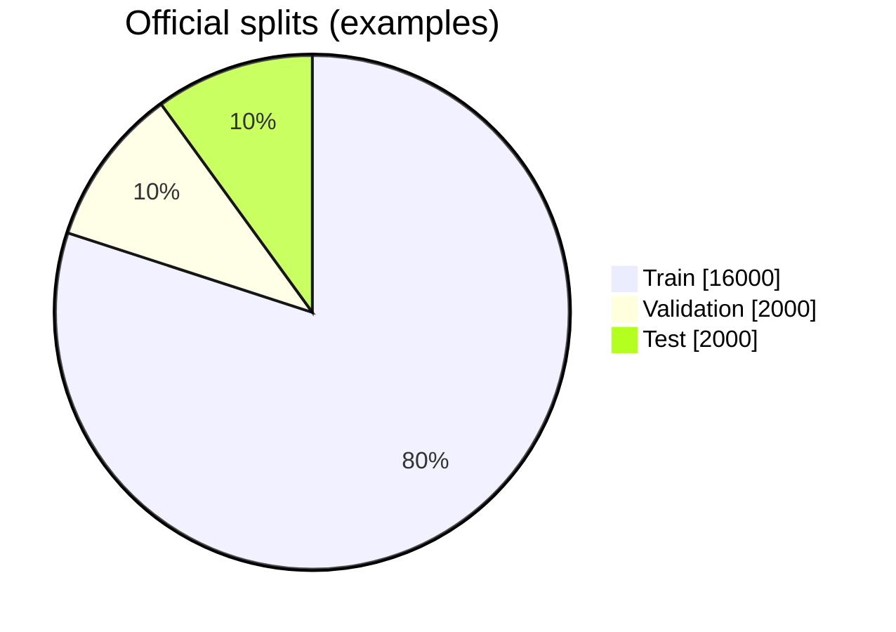
```mermaid
pie showData title Official splits (examples)
    "Train" : 16000
    "Validation" : 2000
    "Test" : 2000
```

| 0 | 1 | 2 | 3 | 4 | 5 |
|:---:|:---:|:---:|:---:|:---:|:---:|
| 😢 sadness | 😄 joy | ❤️ love | 😠 anger | 😨 fear | 😲 surprise |

Label order is fixed and validated in `training/generate_embeddings.py`. Classes are imbalanced (joy and sadness largest; love and surprise smallest), which is why training uses class weights and model selection uses Macro F1.

---

## 👨‍💻 Engineering summary


```mermaid
flowchart LR
    A["🧠 MiniLM + BiGRU<br/>contextual classifier"] --> B["🎯 89.85% accuracy<br/>86.46% Macro F1"]
    B --> C["📦 ONNX export<br/>single artifact"]
    C --> D["⚡ ONNX Runtime +<br/>Rust tokenizers"]
    D --> E["📉 ≈ 630 MB → ≈ 318 MB<br/>measured locally"]
    E --> F["🔌 FastAPI +<br/>web frontend"]
    F --> G["☁️ Live on Render<br/>512 MB limit"]

    classDef a fill:#f1e8ff,stroke:#8b5cf6,color:#1f0b3b
    classDef b fill:#e8fff1,stroke:#16a34a,color:#052e16
    classDef c fill:#fff4e5,stroke:#d97706,color:#3b2300
    classDef d fill:#e8f1ff,stroke:#3b82f6,color:#0b1b33
    class A a
    class B b
    class C,D,E c
    class F,G d
```

**What was built:** a contextual NLP classifier (MiniLM + masked BiGRU) transformed into a lightweight ONNX production pipeline, exposed through FastAPI, connected to a web frontend, and deployed under a 512 MB memory constraint, with an uncertainty safeguard and documented limitations.

<div align="center">

<br>

<sub>Built by <a href="https://github.com/Debasish65368">Debasish</a> · <a href="https://emotion-prediction-0fey.onrender.com">🚀 Live demo</a></sub>

</div>
