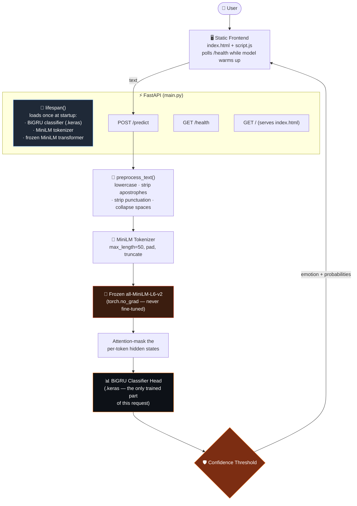
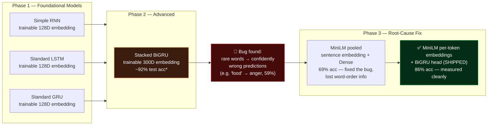
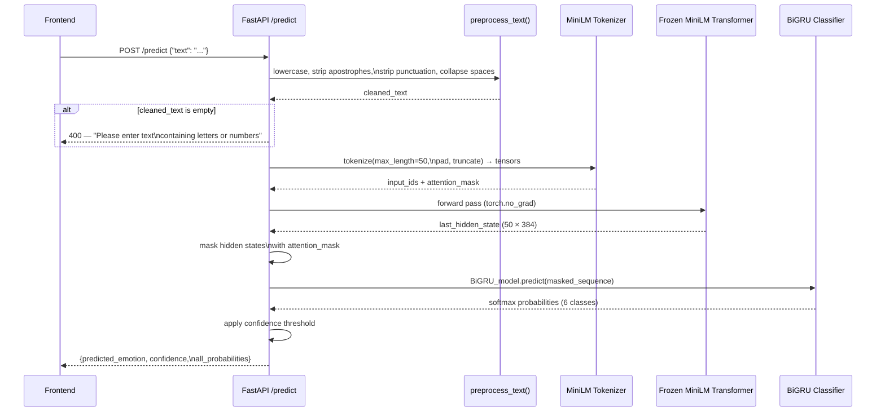
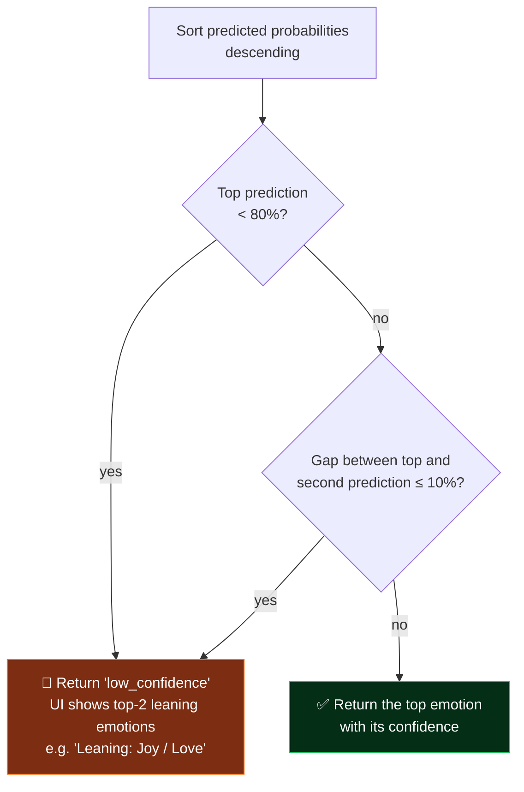
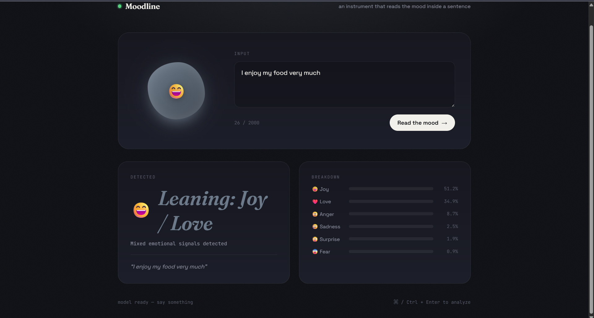

<div align="center">

# 🎭 Moodline — Emotion Prediction from Text

### A FastAPI + deep learning app that predicts the emotion behind a sentence — and the story of finding, diagnosing, and fixing a real embedding bug along the way.


**6 emotion classes · 4 architectures compared · 1 root-caused embedding bug · reproducible 86.50% result**

**Live demo:** https://emotion-prediction-0fey.onrender.com *(runs the older BiGRU model — see [Known Limitations](#-known-limitations) for why)*

</div>

---

## 📖 Table of Contents

- [What This Project Demonstrates](#-what-this-project-demonstrates)
- [Architecture](#-architecture)
- [The Model Evolution Journey](#-the-model-evolution-journey)
- [The Bug I Found](#-the-bug-i-found)
- [The Fix](#-the-fix)
- [Inference Pipeline](#-inference-pipeline)
- [Confidence Threshold Safeguard](#-confidence-threshold-safeguard)
- [Before / After on the Original Bugs](#-before--after-on-the-original-bugs)
- [Screenshots](#-screenshots)
- [Known Limitations](#-known-limitations)
- [API](#-api)
- [Setup](#-setup)
- [Reproducible Training](#-reproducible-training)
- [Tech Stack](#-tech-stack)

---

## 🎯 What This Project Demonstrates

- End-to-end ML workflow: dataset → preprocessing → training → evaluation → deployment
- Debugging a real, reproducible model bug through hypothesis-driven testing, not guesswork
- Comparing four architectures on measured evidence rather than assumption
- Adding a safety mechanism (confidence thresholding) and tuning it against real failure cases
- Honest handling of a real deployment constraint instead of hiding it

---

## 🏗️ Architecture


```mermaid
flowchart TB
    User(["👤 User"])
    FE["🖥️ Static Frontend\nindex.html + script.js\npolls /health while model warms up"]

    subgraph FastAPIApp["⚡ FastAPI (main.py)"]
        direction TB
        Lifespan["🔄 lifespan()\nloads once at startup:\n· BiGRU classifier (.keras)\n· MiniLM tokenizer\n· frozen MiniLM transformer"]
        Predict["POST /predict"]
        Health["GET /health"]
        Root["GET /  (serves index.html)"]
    end

    Pre["🧹 preprocess_text()\nlowercase · strip apostrophes\n· strip punctuation · collapse spaces"]
    Tok["🤗 MiniLM Tokenizer\nmax_length=50, pad, truncate"]
    Trans["🧠 Frozen all-MiniLM-L6-v2\n(torch.no_grad — never fine-tuned)"]
    Mask["Attention-mask the\nper-token hidden states"]
    BiGRU["📊 BiGRU Classifier Head\n(.keras — the only trained part\nof this request)"]
    Thresh{"🛡️ Confidence Threshold"}

    User --> FE
    FE -- "text" --> Predict
    Predict --> Pre --> Tok --> Trans --> Mask --> BiGRU --> Thresh
    Thresh -- "emotion + probabilities" --> FE

    style Lifespan fill:#1f2937,color:#fff,stroke:#60a5fa
    style Trans fill:#3b1d0f,color:#fff,stroke:#EE4C2C
    style BiGRU fill:#0d1117,color:#fff,stroke:#FF6F00
    style Thresh fill:#7c2d12,color:#fff,stroke:#f97316
```

The transformer runs **once per request, frozen, in `torch.no_grad()`** — it only produces embeddings, it's never trained. The BiGRU head is the only component with learned weights specific to this task, which is what keeps both training and inference CPU-friendly.

---

## 🧬 The Model Evolution Journey

Four architectures were built and measured — not assumed — before landing on the shipped model.


```mermaid
flowchart LR
    subgraph Phase1["Phase 1 — Foundational Models"]
        RNN["Simple RNN\ntrainable 128D embedding"]
        LSTM["Standard LSTM\ntrainable 128D embedding"]
        GRU["Standard GRU\ntrainable 128D embedding"]
    end

    subgraph Phase2["Phase 2 — Advanced"]
        BiGRU1["Stacked BiGRU\ntrainable 300D embedding\n~92% test acc*"]
    end

    Bug["🐛 Bug found:\nrare words → confidently\nwrong predictions\n(e.g. 'food' → anger, 59%)"]

    subgraph Phase3["Phase 3 — Root-Cause Fix"]
        Pool["MiniLM pooled\nsentence embedding + Dense\n69% acc — fixed the bug,\nlost word-order info"]
        Final["✅ MiniLM per-token embeddings\n+ BiGRU head (SHIPPED)\n86% acc — measured cleanly"]
    end

    RNN --> Phase2
    LSTM --> Phase2
    GRU --> Phase2
    BiGRU1 --> Bug --> Pool --> Final

    style Bug fill:#450a0a,color:#fff,stroke:#dc2626
    style Final fill:#052e16,color:#fff,stroke:#22c55e
    style BiGRU1 fill:#3b1d0f,color:#fff,stroke:#f97316
```

*\*The 92% figure came with a methodology flaw — the test set doubled as the early-stopping validation set — so it wasn't a clean number, which is part of what motivated re-measuring everything honestly once the rare-word bug surfaced.*

| Approach | Test Accuracy | Notes |
|---|---|---|
| Original from-scratch BiGRU | ~92%* | *Methodology flaw: test set doubled as the early-stopping validation set |
| MiniLM pooled sentence embedding + Dense head | 69% | Fixed the rare-word bug, but pooling to one vector discarded word-order/sequence information, hurting overall accuracy |
| **MiniLM per-token embeddings + BiGRU head (shipped)** | **86.50%** | Cleanly measured — test set touched exactly once. Fixed both bugs while recovering most of the accuracy lost to pooling |

---

## 🐛 The Bug I Found

The original from-scratch BiGRU model, despite reporting ~92% test accuracy, confidently misclassified simple, unambiguous sentences — for example:

> **"I enjoy my food very much" → Anger (59.1% confidence)**

I loaded the model and tokenizer directly and reproduced the bug, then traced the root cause: the word **"food" appeared only 63 times** across 16,000 training examples. With embeddings trained entirely from scratch on a small, narrow (Twitter-sourced) dataset, rare words like this ended up with unstable, spuriously-biased representations that dominated predictions regardless of the rest of the sentence.

A second failure mode showed up too: sentences with a single, isolated emotion cue word (e.g. "I am so happy today") produced low-confidence, near-random predictions — the model relied on multiple reinforcing words rather than robust single-word understanding.

---

## 🔧 The Fix

Replaced the from-scratch trainable embedding layer with **frozen, pretrained MiniLM (`all-MiniLM-L6-v2`) token embeddings**, feeding the resulting sequence into a lightweight BiGRU classifier head. The transformer itself is never fine-tuned — it runs once per sentence to produce embeddings, keeping both training and inference CPU-friendly.

---

## ⚙️ Inference Pipeline

Traced directly from `main.py`'s `/predict` handler:


```mermaid
sequenceDiagram
    participant FE as Frontend
    participant API as FastAPI /predict
    participant Pre as preprocess_text()
    participant Tok as MiniLM Tokenizer
    participant MLM as Frozen MiniLM Transformer
    participant Head as BiGRU Classifier

    FE->>API: POST /predict {"text": "..."}
    API->>Pre: lowercase, strip apostrophes,\nstrip punctuation, collapse spaces
    Pre-->>API: cleaned_text
    alt cleaned_text is empty
        API-->>FE: 400 — "Please enter text\ncontaining letters or numbers"
    end
    API->>Tok: tokenize(max_length=50,\npad, truncate) → tensors
    Tok-->>API: input_ids + attention_mask
    API->>MLM: forward pass (torch.no_grad)
    MLM-->>API: last_hidden_state (50 × 384)
    API->>API: mask hidden states\nwith attention_mask
    API->>Head: BiGRU_model.predict(masked_sequence)
    Head-->>API: softmax probabilities (6 classes)
    API->>API: apply confidence threshold
    API-->>FE: {predicted_emotion, confidence,\nall_probabilities}
```

---

## 🛡️ Confidence Threshold Safeguard

Because a softmax classifier is always forced to pick across its 6 classes — even for genuinely ambiguous or neutral input — the backend applies **two independent guards**, not just a single cutoff:


```mermaid
flowchart TD
    P["Sort predicted probabilities\ndescending"]
    C1{"Top prediction\n< 80%?"}
    C2{"Gap between top and\nsecond prediction ≤ 10%?"}
    U["🤔 Return 'low_confidence'\nUI shows top-2 leaning emotions\ne.g. 'Leaning: Joy / Love'"]
    E["✅ Return the top emotion\nwith its confidence"]

    P --> C1
    C1 -- yes --> U
    C1 -- no --> C2
    C2 -- yes --> U
    C2 -- no --> E

    style U fill:#7c2d12,color:#fff,stroke:#f97316
    style E fill:#052e16,color:#fff,stroke:#22c55e
```

Rather than showing an unhelpful generic "Low Confidence" label, the UI computes the top two leaning emotions from the model's own probability breakdown and displays them directly — e.g. **"Leaning: Joy / Love"** — so the honest hedge reads as a real finding instead of a broken result.

Testing this threshold surfaced a genuinely interesting pattern: the model doesn't hedge randomly. It hedges specifically where there's real linguistic overlap between classes, and stays confident where there isn't. For example, "enjoy"/"love" language around food splits between **joy** and **love** (a real ambiguity — people use both to mean the same thing), while a word like "thrilled" has no such overlap and resolves to joy at 99.9% confidence. The threshold reflects genuine model uncertainty rather than being a blunt catch-all.

At this threshold, the app catches most — but not all — confidently wrong guesses on neutral input (see [Known Limitations](#-known-limitations)).

---

## 📊 Before / After on the Original Bugs

| Sentence | Old Model | New Model |
|---|---|---|
| "I enjoy my food very much" | anger (59.1%) | joy (51.2%) / love (34.9%) — shown as "Leaning: Joy / Love" |
| "I love this food" | anger (87.9%) | love (64.5%) / joy (25.7%) |
| "I am so happy today" | anger/sadness near-tied (~31%) | joy (91.9%) |
| "I can't believe how happy I am right now, this is amazing!" | fear (53.3%) — wrong | joy (73.9%) / surprise (24.4%) — shown as "Leaning: Joy / Surprise" but correctly positive |
| "I am furious about this asparagus" | *(untested on old model)* | anger (99.5%) — confidently correct despite rare word |
| "I'm thrilled about this food" | *(untested on old model)* | joy (99.9%) — confidently correct |

---

## 📸 Screenshots

### 1. Rare-word bug — now honestly low-confidence instead of confidently wrong
*Old model: "anger" at 59.1% confidence. New model: correctly reads the sentence as positive (anger drops to 8.7%), and shows "Leaning: Joy / Love" instead of a flat wrong guess.*



### 2. Rare word + strong negative emotion — stays confidently correct
*"I am furious about this asparagus" — a mostly unseen word doesn't derail the model. Confident anger at 99.5%.*


### 3. Clean, unambiguous case — full confidence, no hedging
*"I feel terrified walking home alone" — a clear, single-emotion sentence with no ambiguity. The model commits fully and correctly, contrasting with the hedged "food" example above.*


---

## ⚠️ Known Limitations

- **The dataset has no "neutral" class.** Since softmax always forces a choice across the 6 emotions, plainly neutral sentences (e.g. "The train arrives at 9am") can still receive a confidently wrong emotion label. The confidence threshold catches most of these — but in testing, roughly 1 in 3 neutral sentences still slipped through even at this threshold. This is a structural limitation of a 6-class forced-choice classifier on a dataset with no neutral option, not something fixable by further threshold tuning alone.
- **Live demo runs the older BiGRU model, not the current code.** The MiniLM-based model loads both TensorFlow and PyTorch plus the transformer weights simultaneously, which exceeds free-tier hosting memory limits (512MB) on Render. Rather than force a paid upgrade, the previously-working deployment was kept live and the fix documented here instead. The evaluation and screenshots above reflect the actual current code in this repo — clone it and run locally (see below) to see it directly.

---

## 🔌 API

### `POST /predict`

Predicts the emotion of the given text and returns the confidence score along with probabilities for all 6 emotions.

**Request:**
```json
{
  "text": "I am so happy today"
}
```

**Response:**
```json
{
  "text": "I am so happy today",
  "predicted_emotion": "joy",
  "confidence": 0.91,
  "all_probabilities": {
    "sadness": 0.01,
    "joy": 0.91,
    "love": 0.03,
    "anger": 0.01,
    "fear": 0.02,
    "surprise": 0.02
  }
}
```

### `GET /health`

Reports whether the BiGRU model, MiniLM tokenizer, and MiniLM transformer have all finished loading — the frontend polls this on load (every 3–5s) to show a "waking the model up…" state during cold starts instead of a silently broken UI.

---

## 🚀 Setup

```bash
git clone https://github.com/Debasish65368/EMOTION-PREDICTION.git
cd EMOTION-PREDICTION
python -m venv .venv
.venv\Scripts\Activate.ps1        # Windows
pip install -r requirements.txt
uvicorn main:app --reload --port 8000
```

Then open `http://127.0.0.1:8000` in your browser.

---

## 🔬 Reproducible Training

The repository now includes a reproducible training/evaluation path for the shipped MiniLM classifier. `all-MiniLM-L6-v2` is used as a **frozen feature extractor** and produces per-token hidden states of size `50 × 384`. Those embeddings are generated in small batches and written to disk-backed `.npy` arrays, so the full embedding matrix does not need to remain in RAM.

The classifier architecture recovered directly from `Artifacts/MiniLM_Sequence_Classifier.keras` is:

```text
Input (50, 384)
  → Masking(0.0)
  → Bidirectional GRU(64 per direction)
  → Dropout(0.3)
  → Dense(32, ReLU)
  → Dropout(0.3)
  → Dense(6, Softmax)
```

The archived model contains **177,126 parameters**, uses Adam with a `1e-3` learning rate, and uses sparse categorical cross-entropy. The restored pipeline uses the dataset's official `train`, `validation`, and `test` splits; the test split is reserved for final evaluation.

From the repository root:

```powershell
python -m training.generate_embeddings --batch-size 16 --device cpu
python -m training.evaluate --model Artifacts/MiniLM_Sequence_Classifier.keras
python -m training.train --batch-size 32
python -m training.evaluate --model Artifacts/MiniLM_Sequence_Classifier_retrained.keras
```

Generated embedding caches and evaluation outputs are intentionally ignored by Git. The training/evaluation scripts are tracked.

### Historical vs Retrained Model

The original README documented approximately **86% test accuracy**. The original training/evaluation source and terminal output were lost with a deleted Antigravity workspace. That number is preserved in `Artifacts/MiniLM_Sequence_Classifier.keras` as a historical baseline.

A fresh evaluation through the restored pipeline with a new retrained model (`Artifacts/MiniLM_Sequence_Classifier_retrained.keras`) yielded:
- **Accuracy**: 86.50%
- **Macro F1**: 80.48%
- **Weighted F1**: 86.48%

This **retrained model is now the production default**, as it offers full provenance and perfectly matches the reconstructed pipeline.

---

## 🐳 Tech Stack

| Layer | Choice |
|---|---|
| **Backend** | FastAPI |
| **Embeddings** | Frozen `sentence-transformers/all-MiniLM-L6-v2` (Hugging Face Transformers + PyTorch) |
| **Classifier head** | Bidirectional GRU (TensorFlow/Keras) |
| **Frontend** | Vanilla HTML/CSS/JS — polls `/health` for cold-start UX |
| **Dataset** | [dair-ai/emotion](https://huggingface.co/datasets/dair-ai/emotion) — 16K labeled sentences, 6 classes |
| **Deployment** | Render |